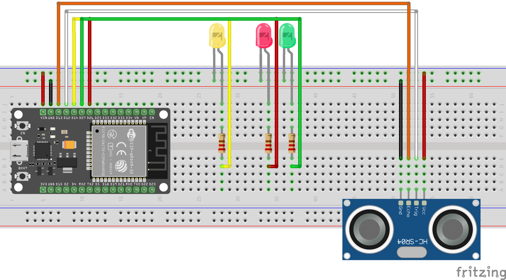

# Smart Entulho

Sistema de monitoramento inteligente de lixeiras urbanas com ESP32, sensor ultrassônico e comunicação MQTT via HiveMQ Cloud.



## Visão Geral

O dispositivo mede continuamente o nível de preenchimento da lixeira com um sensor HC-SR04, sinaliza o status via LEDs e publica os dados em tempo real em um broker MQTT na nuvem, permitindo monitoramento remoto por dashboards ou sistemas de gestão.

## Hardware Necessário

| Componente | Quantidade |
|---|---|
| ESP32 (DevKit) | 1 |
| Sensor Ultrassônico HC-SR04 | 1 |
| LED Verde | 1 |
| LED Amarelo | 1 |
| LED Vermelho | 1 |
| Resistores 220 Ω | 3 |
| Protoboard + Jumpers | — |

## Pinagem

| Pino ESP32 | Componente |
|---|---|
| GPIO 12 | HC-SR04 TRIG |
| GPIO 13 | HC-SR04 ECHO |
| GPIO 14 | LED Amarelo |
| GPIO 27 | LED Verde |
| GPIO 26 | LED Vermelho |

## Lógica de Status

| Preenchimento | LED | Status MQTT |
|---|---|---|
| < 50 % | Verde | `OK` |
| 50 % – 80 % | Amarelo | `ALERTA` |
| > 80 % | Vermelho | `CRITICO` |

## Configuração

### 1. Dependências (Arduino IDE)

Instale as bibliotecas abaixo via **Sketch → Incluir Biblioteca → Gerenciar Bibliotecas**:

- `PubSubClient` (Nick O'Leary)
- `ArduinoJson` (Benoit Blanchon)

Placa: **ESP32** via Gerenciador de Placas (`https://raw.githubusercontent.com/espressif/arduino-esp32/gh-pages/package_esp32_index.json`)

### 2. Credenciais

Copie o arquivo de exemplo e preencha com seus dados:

```bash
cp config.h.example config.h
```

Edite `config.h` com sua rede Wi-Fi e as credenciais do seu broker MQTT (HiveMQ Cloud ou outro compatível com TLS na porta 8883).

> **Atenção:** o arquivo `config.h` está no `.gitignore` e nunca deve ser enviado ao repositório.

### 3. Parâmetros da Lixeira

No topo de `SmartEntulho.ino`, ajuste:

```cpp
const float ALTURA_MAXIMA_LIXEIRA = 50.0; // altura interna da lixeira em cm
const char* ID_LIXEIRA = "MACK_URB_001";  // identificador único do dispositivo
```

## Formato da Mensagem MQTT

**Tópico:** `v1/smartbin/status`

```json
{
  "id_lixeira": "MACK_URB_001",
  "volume_porcentagem": "73.4",
  "status": "ALERTA"
}
```

## Estrutura do Projeto

```
SmartEntulho/
├── SmartEntulho.ino      # Firmware principal
├── config.h              # Credenciais locais (ignorado pelo git)
├── config.h.example      # Template de configuração
├── assets/
│   └── circuit.png       # Diagrama do circuito
└── README.md
```

## Licença

MIT
